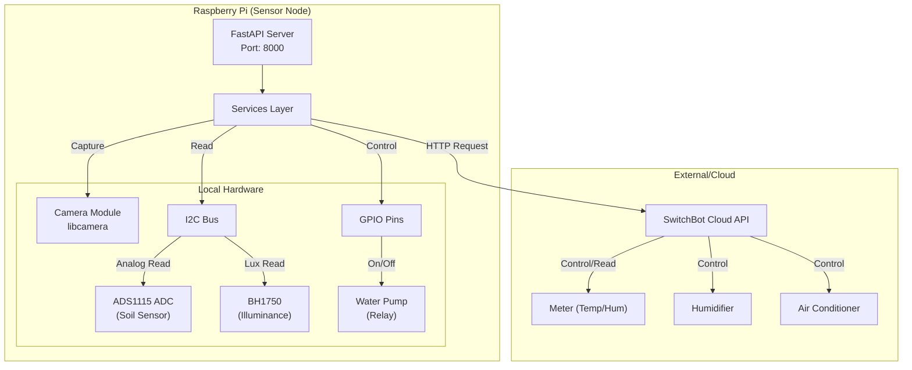

# sensor-node

Raspberry Pi カメラ画像の取得、SwitchBot 温湿度計/エアコン/加湿器の制御、土壌センサー/BH1750照度センサーの読み取りを FastAPI で提供します。

## 構成
```
.
├── app
│   ├── api
│   │   └── routes.py       # ルーティングとエンドポイント
│   ├── services
│   │   └── camera.py       # カメラ撮影ロジック
│   │   └── switchbot.py    # Switchbot APIクライアント
│   │   └── soil.py         # 土壌センサー読み取り
│   │   └── bh1750.py       # BH1750照度センサー読み取り
│   ├── schemas
│   │   └── switchbot.py    # Switchbot制御の入力モデル
│   └── app.py              # FastAPI アプリ工場関数
├── main.py                 # uvicorn で読み込むエントリポイント
└── README.md
```

## システム構成図 (Architecture)



## 前提
- Raspberry Pi OS 環境で `rpicam-jpeg` コマンドが利用可能であること
- 土壌センサーは ADS1115 (Adafruit-ADS1x15) を使用するため I2C を有効化済みであること
- BH1750 照度センサーも I2C を使用します
- Python 3.9+ を想定

## セットアップ
```bash
cp .env.example .env
pip install -r requirements.txt
```

## 環境変数
- `SWITCHBOT_TOKEN`: SwitchBot API トークン
- `SWITCHBOT_SECRET`: SwitchBot API シークレット
- `SWITCHBOT_METER_DEVICE_ID`: 温湿度計のデバイスID（`/sensor/meter` 用）
- `SWITCHBOT_AC_DEVICE_ID`: エアコンのデバイスID（`/control/air-conditioner/settings` 用）
- `SWITCHBOT_HUMIDIFIER_DEVICE_ID`: 加湿器のデバイスID（`/control/humidifier/settings` 用）
- `MOCK_SENSORS`: `true` で土壌センサーをモック値にする（開発環境向け）

## サーバー起動
スクリプトを用意しています（デフォルトポート 8000）。
```bash
chmod +x scripts/run.sh
./scripts/run.sh
```

または直接 uvicorn を指定しても OK です。
```bash
uvicorn main:app --host 0.0.0.0 --port 8000
```

## 画像取得
GET `/image` で最新フレームを取得します。クエリで `width` と `height` を指定可能です（未指定ならカメラ側のデフォルト）。

例:
```bash
curl "http://localhost:8000/image?width=800&height=600"
```

レスポンス例:
```json
{
	"width": 800,
	"height": 600,
	"format": "jpeg",
	"data_base64": "...base64..."
}
```

## Switchbot 温湿度取得
### データの取得
GET `/sensor/meter` で設定された温湿度計からデータを取得します。

例:
```bash
curl "http://localhost:8000/sensor/meter"
```

レスポンス例:
```json
{
  "temperature": 25.5,
  "humidity": 50
}
```

## 土壌水分取得
GET `/sensor/soil` で土壌センサー値を取得します。`MOCK_SENSORS=true` の場合はダミー値を返します。

例:
```bash
curl "http://localhost:8000/sensor/soil"
```

レスポンス例:
```json
{
  "raw_value": 10500,
  "moisture_percent": 50.0,
  "status": "mock"
  "status": "mock"
}
```

## BH1750 照度取得
GET `/sensor/bh1750` で照度センサー値を取得します。I2Cデバイスが見つからない場合はモック値を返します。

例:
```bash
curl "http://localhost:8000/sensor/bh1750"
```

レスポンス例:
```json
{
  "lux": 150.0,
  "status": "ok"
}
```

## エアコン設定（SwitchBot）
POST `/control/air-conditioner/settings` に JSON を送ると設定を変更します。

例:
```bash
curl -X POST "http://localhost:8000/control/air-conditioner/settings" \
  -H "Content-Type: application/json" \
  -d '{"temperature":25,"mode":5,"fan_speed":1,"is_on":true}'
```

`mode` は `1=AUTO, 2=COOL, 3=DRY, 4=FAN, 5=HEAT`、`fan_speed` は `1=AUTO, 2=LOW, 3=MEDIUM, 4=HIGH` です。

## 加湿器設定（SwitchBot）
POST `/control/humidifier/settings` に JSON を送ると設定を変更します。

例:
```bash
curl -X POST "http://localhost:8000/control/humidifier/settings" \
  -H "Content-Type: application/json" \
  -d '{"mode":"103","is_on":true}'
```

`mode` は文字列で `auto`, `101`(LOW), `102`(MEDIUM), `103`(HIGH) を指定します。`is_on` を `false` にすると電源をオフにします。

## ポンプ制御（給水）
POST `/control/pump` に JSON を送るとポンプを制御します（指定された水量を時間に換算して稼働）。

例:
```bash
curl -X POST "http://localhost:8000/control/pump" \
  -H "Content-Type: application/json" \
  -d '{"volume_ml": 50}'
```

レスポンス例:
```json
{
    "status": "success",
    "message": "Poured 50.0ml",
    "duration_sec": 0.88
}
```

## 参考: 手動撮影コマンド
FastAPI を介さずに撮影する場合の例です。
```bash
rpicam-jpeg -o test.jpg -t 2000 --width 800 --height 600
```
